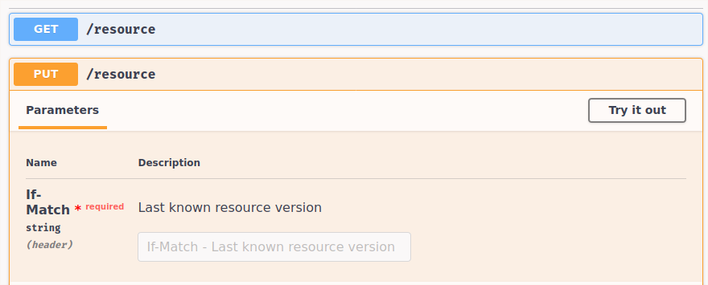

Optimistic Concurrency Control in HTTP Services
===============================================

This project demonstrates how to expose versioned resources over HTTP
and to handle concurrent updates by leveraging the HTTP headers `ETag`
and `If-Match`.

See also: https://developer.mozilla.org/en-US/docs/Web/HTTP/Headers/ETag

## Run

~~~
$ sbt
> run
~~~

Then go to [http://0.0.0.0:8000](http://0.0.0.0:8000) and play with
the interactive documentation!
